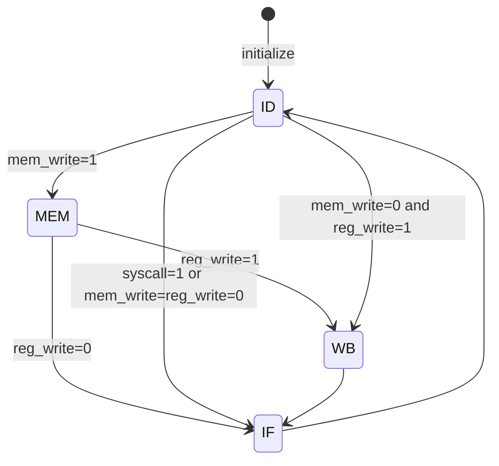

## Report of CS202 Final Project

### Part 1. Introduction to Our CPU

#### (1) Cycle Design

We designed a multi-cycle CPU, whose implementation will be introduced in detail in **Part 2**.

#### (2) CPI

Since we have designed a multi-cycle CPU, our CPI varies from 2 to 4 according to different instructions.

#### (3) Reset Signal

Our reset signal is high-sensitive, which means our CPU will be reset to initial stage if the reset signal is high.

#### (4) Interfaces

Our CPU uses 23 switches, 17 LEDs, a 7-segment digital display tube as IO, and a UART transmit interface.

`K17` to `L21` is the 17 LEDs that used in outputting data.

`Y9` is the reset switch, `W9` to `U6` is the 16 switches that used in inputting numbers, `W5` is the enable switch of 7-segment tube, `W6` is the enable switch of LED, `U5` is the switch used in switching test case 1 and test case 2, `T5`, `T4` and `R4` are the 3 switches used in switching mode in each test case.

`W4` is the UART transmit enable signal and `Y19` is the interface receiving UART data. Once the signal is high, all the sequential modules except the Instruction Memory will be reset. Then the Instruction Memory will be rewritten with the data that is transmitted into FPGA through UART by `Y19`.


### Part 2. Top Module Introduction

Our CPU's top module is actually a wrapper that wraps CPU and IO processors into one module (see **Part 4**.)

We call top module as **CPU wrap module** and the CPU top module (has all the sub-modules) as **CPU top module**.

In CPU wrap module, it get the raw input data from outside and send processed input data into CPU, also it will get the raw output data from CPU and send processed signals to LED and 7-segment tubes (see **Part 4**). This can reduce the coupling of our modules.


<center style="font-family:Arial;font-weight:bold">Figure 1. Connection of sub-modules</center>

The diagram of inner connection of CPU top module is shown in Figure 1.


### Part 3. Sub-module Introductions

#### (1) Clock divider

```verilog
input clkin;			// clock signal generated by oscillation in Y18
output clkout;			// modified clock signal with lower frequency
```

Modify the oscillation in `Y18` into a signal with acceptable frequency.

#### (2) Instruction Fetcher

```verilog
// inputs
// from ALU
input       [31:0]        Addr_result;			// the calculated address from ALU
input                     Zero;					// while Zero is 1, it means the ALUresult is zero

input       [31:0]        read_data_1;			// the address of instruction used by jr instruction
input                     Branch;
input                     nBranch;
input                     Jmp;
input                     Jal;
input                     Jr;
input                     clock;
input                     reset;                  
input                     Pause;
input                     IF_ena;				// enable signal from FSA (see Part 5)

// uart inputs
input wire                renew;				// renew == 1 means CPU is rewriting instructions into memory
input wire  [31:0]        imem_write_data;		// data transmitted into FPGA through UART
input wire  [31:0]        addr_pointer;			// the address that a instruction from UART should be written to

// outputs
output      [31:0]        Instruction;
output      [31:0]        branch_base_addr;		// (pc+4) to ALU which is used by branch type instruction
output      [31:0]        link_addr;			// (pc+4) to decoder which is used by jal
```

Fetch instructions from instruction memory according to PC and update PC according to instruction. **It will update PC at positive edge and at every negative edge the instruction in memory will be read.**

#### (3) Decoder

```verilog
// inputs
input       [31:0]  Instruction;
input       [31:0]  read_data;
input       [31:0]  ALU_result;
input       [31:0]  io_input;			// input from outside (processed by CPU wrap module)
input               Jal;				// 0 : data from alu, write to rt/rd 1 : data from pc + 4, write to $ra
input               RegWrite;			// write in register
input               MemtoReg;			// 1 : read data 0 : alu result
input               RegDST;				// 0 : rt 1 : rd
input               clock, reset;
input       [31:0]  opcplus4;           // from ifetch link_address
input               ID_ena;				// enable signal from FSA (see Part 5)
input               WB_ena;				// enable signal from FSA (see Part 5)

// outputs
output reg  [31:0]  read_data_1;
output reg  [31:0]  read_data_2;
output reg  [31:0]  imme_extend;
output reg  [31:0]  io_output;			// output to the LED and 7-segment tube
output reg          Pause;				// 1s stop signal
```

Sensitive to positive edge of clock signal. Decode the instruction, get data from registers and write data back to registers. **Also it will process the operation of I/O and pause** (see **Part 4**). 

#### (4) Controller

```verilog
// inputs
input   [5:0]   Opcode;
input   [5:0]   Function_opcode;

//outputs
output          Jr;
output          RegDST;
output          ALUSrc;
output          MemtoReg;
output          Jmp;
output          Jal;
output          Branch;
output          nBranch;
output          RegWrite;
output          MemWrite;
output          I_format;
output          Sftmd;
output  [1:0]   ALUOp;
output          syscall;				// whether the current instruction is syscall (see Part 4)
```

Resolve the current instruction and send out control signals to the other modules.

#### (5) ALU

```verilog
// inputs
// from decoder
input       [31:0]  read_data_1;        // the source of Ainput
input       [31:0]  read_data_2;        // one of the sources of Binput
input       [31:0]  imme_extend;        // one of the sources of Binput
// from ifetch
input       [5:0]   Function_opcode;    // instructions[5:0]
input       [5:0]   opcode;             // instruction[31:26]
input       [4:0]   Shamt;              // instruction[10:6], the amount of shift bits
input       [31:0]  PC_plus_4;          // pc + 4
// from controller
input       [1:0]   ALUOp;              // { (R_format || I_format) , (Branch || nBranch) }
input               ALUSrc;             // 1 means the 2nd operand is an immedite (except beq，bne)
input               I_format;           // 1 means I-Type instruction except beq, bne, LW, SW
input               Sftmd;              // 1 means this is a shift instruction
input               Jr;                 // 1 means this is a jr instr

// outputs
output              Zero;               // 1 means the ALU_reslut is zero, 0 otherwise
output reg  [31:0]  ALU_Result;         // the ALU calculation result
output      [31:0]  Addr_Result;        // the calculated instruction address
```

Calculate the result of mathematical operations and PC addresses.

#### (6) Data Memory

```verilog
// inputs
input               clock;
input   [31:0]      address;
input   [31:0]      write_data;
input               Memwrite;			// control signal from controller
input               MEM_ena;			// enable signal from FSA (see Part 5)
input               renew;				// uart mode signal
input   [31:0]      uart_data;			// data read from uart
input   [31:0]      uart_addr;			// uart data write address

// outputs
output  [31:0]      read_data;
```

Read data according to address at every positive edge. Write data to specific address at positive edge while enable signal is high.

#### (7) UART Reader

```verilog
// inputs
input                   reset;
input                   clock;
input                   din;				// data transmitted through UART, 1 bit at one time

// outputs
output reg  [31:0]      imem_write_data;	// data that should be written to memories
output reg  [31:0]      addr_pointer;		// the write address of a memory
```

Receives the data transmitted by UART through `Y19`, one bit at each time at positive edge, and it will save it until it get 32 bits.

Send the write data and the address to the memory, the write data always corresponds to the address.

Once the UART reader receives 32 bit, it will refresh `imem_write_data` and `addr_pointer`.

#### (8) Tube Parser

```verilog
// inputs
input                   rst;
input                   clk;
input       [31:0]      input_num;			// raw output data from CPU (see Part 4)

// outputs
output reg  [7: 0]      seg_en;				// 7-segment tube control signals
output reg  [7: 0]      seg_out;			// 7-segment tube control signals
```

Parse the raw data in `io_output` into the signals that control the display of 7-segment tube (see **Part 4**).

At each positive edge, it will refresh `seg_en` and `seg_out` to display different numbers on the tube at different digits.


### Part 4.  `syscall` Instruction & I/O Design & Pause Design

Different from the IO design in PPT, we designed an architecture of IO imitating the `syscall` instruction in MIPS.

We added a new instruction `syscall`, which in machine code is `0xFFFFFFFF`.

Once the controller and decoder find that the current instruction is `syscall`, the controller will set `syscall` signal to high (this will be received by the FSA in the top module), and decoder will get the data in register `$v0`, and execute the input, output or pause process according to `$v0`. If `$v0 == 5` then input; if `$v0 == 1` then output; if `$v0 == 111` then pause for 1 second. The implementation is shown in Code 1.

```verilog
// in decoder
if(Instruction == 32'hffff_ffff)
begin
    if(Registers[2] == 32'd5)
        Registers[2] <= io_input;
    else if (Registers[2] == 32'd1)
        io_output <= Registers[4];
    else if (Registers[2] == 32'd111)
    begin
        if(counter == 32'h00af_79e0) // a counter used to count 11,500,000 cycles (1 second)
        begin
            Pause <= 1'b0;
            counter <= 32'h0000_0000;
        end
        else
        begin
            Pause <= 1'b1;
            counter <= counter + 1'b1;
        end
    end
end

// in controller
assign syscall = (Opcode == 6'b111111) ? 1'b1 : 1'b0;
```

<center style="font-family:Arial;font-weight:bold">Code 1. Syscall response</center>

We will introduce input, output and pause in detail.

#### (1) Input

We added a new 32-bit port `io_input` in module decoder. The top wrap module receives the signals from the switches, process it into a 32-bit number and send it to `io_input` in decoder. The 32 bits respectively stand for:

```
io_input[31]: 1 represents the current case is testcase 2 and 0 represents testcase 1.
io_input[30:28]: The three input mode signals.
io_input[27:16]: No meaning, all set to 0.
io_input[15:0]: 16 input number signals.
```

Once the decoder finds `$v0 == 5`, it will assign `$v0` with the 32 bits in `io_input`, just the same as MIPS.

Then the input is read into `$v0` and we can process it through instructions.

#### (2) Output

We added a new 32-bit register-type port `io_output` as the output port in module decoder. Once the decoder finds `$v0 == 1`, it will assign `io_input` with the data in `$a0`, just like MIPS.

The `io_output` port will continuously send out signals to the top wrap module outside the CPU. There is one thing important that no matter the output device is 7-segment tube or LED, the data in `io_output` is the same.

```verilog
// in module cpu_wrap, which is the upper module of CPU.
// For LED, we only need to output the lower 17 bits in io_output
assign led_out_sig = (led_output & ~reset) ? io_output[16:0] : 17'b0_0000_0000_0000_00000;
assign seg_en = (tube_output & ~reset) ? seg_en_orig : 8'b1111_1111;
assign seg_out = (tube_output & ~reset) ? seg_out_orig : 8'b1111_1111;

Tube_Show ts( // This is a module that parses raw number into 7-segment signals
              .rst(reset),
              .clk(div_clk),
              .input_num(io_output),
              .seg_en(seg_en_orig),
              .seg_out(seg_out_orig)
          );
```

<center style="font-family:Arial;font-weight:bold">Code 2. Output signals</center>

We know that to show a same number in 7-segment tube and LED, we need two groups of totally different signals. So the top module will parse the raw signal in `io_input` into signals that can be recognized by LED and 7-segment tube. The code is shown in Code 2, `led_output` and `tube_output` are the led enable signal and tube enable signal.

In instructions, we only need to assign `$a0` with the output number we want, set `$v0` to 1 and `syscall`, then the number in `$a0` will be shown in LED and 7-segment tube.

**The advantage of this I/O design: reduced coupling. The input and output of CPU is standardized, and all the jobs that turns the signal into LED signal and 7-segment tube signals are done outside the CPU.**

#### (3) Pause

When the decoder finds `$v0 == 111`, it will set signal `pause` to high and start a counter. 

```verilog
// in decoder
if(counter == 32'h00af_79e0) // 11,500,000
begin
    Pause <= 1'b0;
    counter <= 32'h0000_0000;
end
else
begin
    Pause <= 1'b1;
    counter <= counter + 1'b1;
end

// in instruction fetcher
if (IF_ena)
begin
    if (Pause) // if paused, stop updating PC
    begin
    end
    else if (Jal || Jmp)
        PC <= {4'b0000, Instruction[25:0], 2'b00};
    else
        PC <= Next_PC;
end
```

<center style="font-family:Arial;font-weight:bold">Code 3. Pause design</center>

Once the instruction fetcher finds that the `pause` signal is high, it will stop updating PC, keep PC pointing to the current instruction (i.e.`syscall`), so in the next stage `ID` decoder will keep decoding the `syscall` instruction and counting. The codes are shown in Code 3.

Until 11,500,000 cycles (1 second) have passed, the decoder will set pause to 0 and the instruction fetcher will restart to update PC again.


### Part 5. Introduction to Multi-Cycle Design

To implement a multi-cycle CPU which can skip stages according to different instructions, we divided a instruction into 4 stages: `IF`, `ID`, `MEM` and `WB`. 

Also, we added a finite state automata (FSA) into the CPU top module and the codes are shown in Code 4.

```verilog
wire              IF_ena, ID_ena, MEM_ena, WB_ena;
assign IF_ena = (main_counter == 2'b00) ? 1'b1 : 1'b0;
assign ID_ena = (main_counter == 2'b01) ? 1'b1 : 1'b0;
assign MEM_ena = (main_counter == 2'b10) ? 1'b1 : 1'b0;
assign WB_ena = (main_counter == 2'b11) ? 1'b1 : 1'b0;

always @(posedge clock or posedge rst)
begin
    if(rst)
    begin
        main_counter <= 2'b01;
    end
    else
    begin
        case (main_counter)
            2'b00:
                main_counter <= 2'b01;
            2'b01:
            begin
                if (syscall) 
                    // Since all the jobs using syscall are done in ID, we can skip the stage MEM and WB
                    main_counter <= 2'b00;
                else if (MemWrite)
                    main_counter <= 2'b10;
                else if (RegWrite)
                    main_counter <= 2'b11;
                else
                    main_counter <= 2'b00;
            end
            2'b10:
            begin
                if (RegWrite)
                    main_counter <= 2'b11;
                else
                    main_counter <= 2'b00;
            end
            2'b11:
                main_counter <= 2'b00;
        endcase
    end
end
```

<center style="font-family:Arial;font-weight:bold">Code 4. FSA design</center>

The FSA receives the control signals such as `reg_write`, `mem_write`, `syscall` from the controller, and send out enable signals to the sub-modules. Once a positive edge of the clock comes, a module can execute only when it has the enable signal from the controller and the FSA at the same time. The state diagram is shown in Figure 1.




<center style="font-family:Arial;font-weight:bold">Figure 1. State Diagram of FSA</center>

The initial state is ID, because in `IF` stage the we designed to update PC, but at the initial state PC already points at the first instruction so we should not update it.

Using this design, we implemented a multi-cycle CPU that can skip stages according to different instructions.


### Part 6. Problems & Solutions

**Problem 1:** In our design, reading from registers is a sequential process, and this is because we didn't realize that this can be done without clock signal. As a result, to avoid data disorder we must use more than 1 cycle to finish a instruction.

**Solution 1:** We designed a multi-cycle CPU and divided a instruction into 4 stages. Though in our perspective this is design is as good as single-cycle, we paid a lot of time to modify the CPU into a multi-cycle one, such as adding FSA, adding new control signals. From this experience we have learnt that it's important to have a compact analysis before coding.


**Problem 2:** Sometimes the simulation result is not the same as what FPGA shows in the real case.

**Solution 2:** We did troubleshooting by testing each sub-module separately on FPGA and finally find the module having problem. We will usually reduce the coupling among modules to solve problems and this usually works. This taught us that is important to reduce the coupling among modules: this can not only make it easier to find the problem but can also lower the distortion rate.

